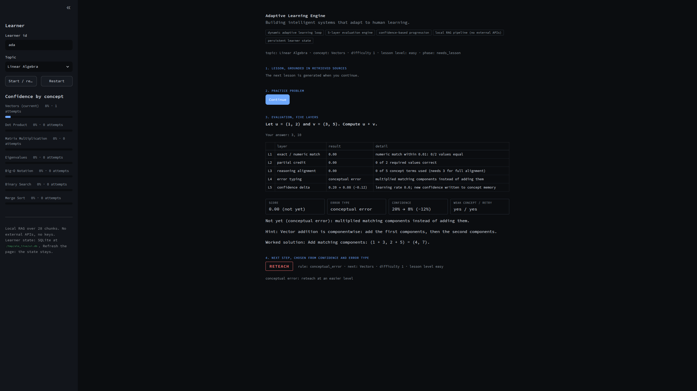
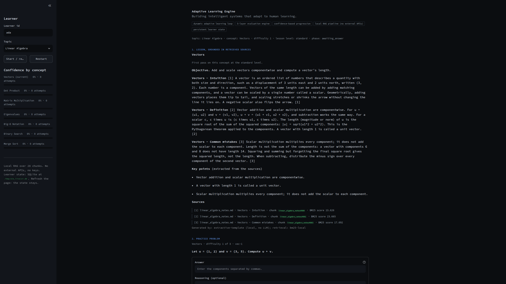
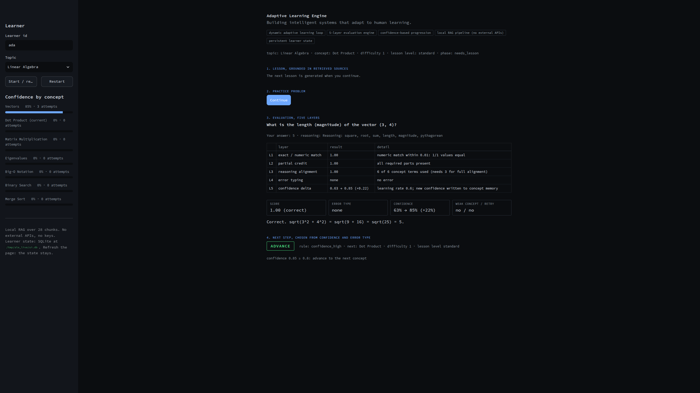

# Adaptive Learning Engine

**Building intelligent systems that adapt to human learning.**

A production-oriented system that moves beyond static tutoring into true adaptive learning. It teaches a
concept from retrieved sources, grades your answer on five layers, updates a per-concept confidence, and
decides what you see next: advance, practice harder, repeat, or reteach. It runs entirely on your
machine, with no external APIs and no keys.



## The five claims, and where each one lives in code

| Claim | Implementation |
| --- | --- |
| Dynamic adaptive learning loop | `ale/engine/tutor.py` drives lesson, problem, answer, evaluation, progression, memory. The session phase is persisted, so the loop resumes where it stopped. |
| 5-layer evaluation engine | `ale/engine/evaluation.py`: exact/numeric match, partial credit, reasoning alignment, error typing, confidence delta. All five are returned with every answer. |
| Confidence-based progression | `ale/engine/progression.py`: a pure function with four actions, driven by confidence and error type (rules below). |
| Local RAG pipeline (no external APIs) | `ale/engine/ingest.py`, `retrieval.py`, `lesson.py`: chunking, SQLite chunk store, pure-Python BM25, extractive lessons with citations. No network calls anywhere in the engine. |
| Persistent learner state | `ale/engine/store.py`: SQLite (WAL). Memory, sessions, issued problems, attempts and lesson history survive a restart. |

## Quick start

Declared as Python 3.10+; developed and tested only on 3.14.

```bash
python -m venv .venv
source .venv/bin/activate
pip install -e ".[dev]"          # engine, API, Streamlit UI, PDF reader, test tools
# lighter installs: pip install -e .  (engine + API)   pip install -e ".[ui]"  (adds the UI)

pytest                           # run the test suite
python -m ale demo               # the full loop in the terminal, exits 0
python -m ale ui                 # Streamlit UI at http://localhost:8501
python -m ale serve              # HTTP API at http://127.0.0.1:8000  (docs at /docs)
```

The demo script uses a temporary database unless you pass `--db`. The UI and API store state in
`data/ale.db` (override with `ALE_DB=/path/to.db`). That path is git-ignored.

What a reviewer should see is spelled out in [docs/demo.md](docs/demo.md).

## How the loop decides

1. **Retrieve.** BM25 over the corpus chunks, with section headings weighted. A relevance floor drops
   off-topic hits. After a reteach, the lesson prefers sections the learner has not just seen.
2. **Teach.** An extractive lesson: the retrieved passages in reading order, key points, and numbered
   citations (`source`, `section`, `chunk_id`, BM25 `score`, `excerpt`). No generative model is involved.
3. **Evaluate.** Five layers:
   1. exact / numeric match (tolerant of fractions, negatives, number words, Big-O canonical forms)
   2. partial credit (how many required parts are right)
   3. reasoning alignment (concept terms used in the optional explanation)
   4. error typing: `conceptual_error`, `calculation_error`, `misinterpretation`, `incomplete`, `none`
   5. confidence delta (EMA: learning rate 0.6 for the first three attempts, then 0.4)
4. **Progress.** First matching rule wins:

   | Order | Condition | Action |
   | --- | --- | --- |
   | 1 | 3+ consecutive failures | `reteach` (easier level) |
   | 2 | conceptual error or misinterpretation | `reteach` (easier level) |
   | 3 | calculation error | `repeat` (fresh problem, no reteach) |
   | 4 | answer failed for any other reason | `repeat` |
   | 5 | confidence >= 0.8 | `advance` to the next concept |
   | 6 | 0.5 <= confidence < 0.8 | `practice_harder` |
   | 7 | confidence < 0.5 | `repeat` |

5. **Remember.** Confidence, the closed problem, the attempt and the next session state are written in one
   SQLite transaction.

## Architecture

```
ale/
  engine/        core, no web or UI imports
    config.py        thresholds and paths
    text.py          normalisation, stemming, number parsing
    curriculum.py    topics, concepts, problem bank (data/curriculum.json)
    ingest.py        Markdown / text / PDF -> chunks (+ the bundled fixture corpus)
    retrieval.py     BM25 retriever and citation shape
    lesson.py        extractive lesson builder
    problems.py      problem selection (difficulty, then least-issued)
    evaluation.py    the five evaluation layers
    progression.py   next-step policy
    store.py         SQLite persistence
    tutor.py         the service that ties it together
  interfaces/    thin adapters over Tutor
    api.py           FastAPI, {status, data} / {status, error} envelope
    cli.py           demo, serve, ui, ingest, progress, simulate
    ui.py            Streamlit app
  research/
    simulate.py      simulated learners to check the policy's behaviour
tests/               pytest suite
```

### HTTP API

One envelope for everything: `{"status": "success", "data": ...}` or
`{"status": "error", "error": {"message": ..., "code": ...}}`. Validation failures and unexpected exceptions
return the same envelope, never a stack trace.

| Method | Path | Purpose |
| --- | --- | --- |
| GET | `/health` | liveness and chunk count |
| GET | `/api/topics` | topics and concepts |
| GET | `/api/search?q=&k=` | retrieval with citations |
| POST | `/api/sessions` | start or resume a topic for a user |
| GET | `/api/users/{id}/session` | recoverable session state |
| GET | `/api/users/{id}/lesson` | current lesson with citations |
| GET | `/api/users/{id}/problem` | current problem (never includes the answer key) |
| POST | `/api/users/{id}/answers` | evaluate an answer and get the next step |
| GET | `/api/users/{id}/progress` | confidence per concept |

## Corpus

The repository ships a small, original fixture corpus (`ale/engine/data/corpus/`, 28 sections across 7
concepts) so everything works offline and the tests are deterministic. To teach from your own material:

```bash
pip install -e ".[pdf]"
python -m ale ingest path/to/notes_or_pdfs
```

Ingested documents are stored in the local SQLite database (git-ignored). PDFs and downloaded corpora are
not committed. Note that the problem bank and curriculum cover the seven bundled concepts; extra documents
add retrieval material for those concepts, they do not create new problems.

## Research: simulated learners

`python -m ale simulate` runs four scripted personas through the real loop (mastery, careless, confused,
struggling) and prints how many steps each needs and which actions fired. It is a behavioural sanity check
of the policy, not evidence about real learners.

## What this is / is not

**This is** a local adaptive tutor: a working, tested implementation of the loop above, with persistent
state, running offline on a small fixture corpus.

**This is not** a hosted chatbot, a generative-AI tutor, or a measured production deployment. There are no
user studies, no learning-outcome metrics, and no claims about scale. Lessons are extracted from the
corpus, not written by a model. See [NOTES.md](NOTES.md) for the concrete limits.

## Screenshots

Taken from the running UI with the commands in [docs/demo.md](docs/demo.md).

| Lesson with sources | After a restart and refresh |
| --- | --- |
|  |  |

## License

MIT. See [LICENSE](LICENSE).
